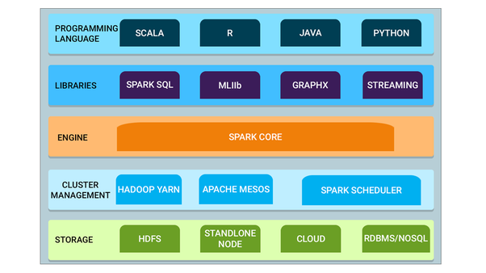
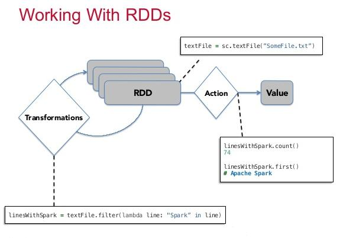
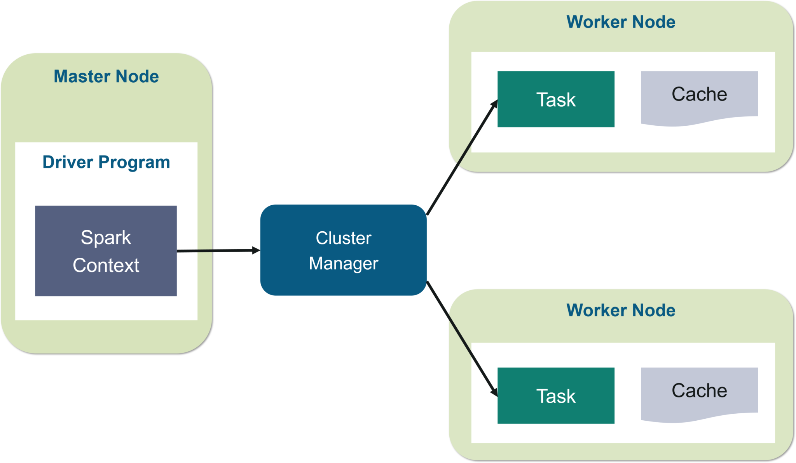

# Introduction to Apache Spark
## What is Spark
* Open Source:
* Parallel:\
  Spark distributes the data across the cluster and then process data in parallel.
* Scalable:
* In-memory computing: \
  You can imagine that there is a memory layer at each node of the cluster. Hadoop stores data in disc instead.

## Features of Spark
* Speed: \
  Swift data processing framework - fast\
  Because in-memory, ~10 times faster than Hadoop.
* Powerful caching: \
  It has simple programming layer and disk persistence capability. Synchronization between cache and disc is reliable
* Deployment: \
  Can be deployed to Mesos, Hadoop, or Spark own cluster manager
* Real-time:\
  Low latency because of in-memory computation
* Polyglot:\
  Provide high-level API in Java, Scala, Python, and R.

## Spark Eco-System


## RDDs
Why RDD? \
Because of iterative processes, reusing data, and sharing data, there are a lot of I/O processes. If all of these happen in HDFS, it is very slow. In-memory processing is ~200 faster than internet networking.

What is RDD? \
RDD is resilient (fault-tolerant) distributed data set. RDDs represent a collection of items distributed across many compute nodes that can be manipulated in parallel. They are Spark's main programming abstraction. RDD is immutable, i.e. update is add new and then delete old.

3 ways to create RDDs:
1. Parallel collections
2. From existing RDDs
3. From external data like HDFS, S3

Labs in Oracle VM VirtualBox:
```
# JPS (Java VM Process Status Tool) is a command to check all the Hadoop daemons like NameNode (master), DataNode (slaves), Resource Manager, NodeManager, etc.
$sudo jps

$spark-shell

######################################
# Create RDD from parallel collections
######################################
# sc.parallelize creates 5 partitions for 1 to 100.
# collect() is a action to start the process
scala> sc.parallelize(1 to 100, 5).collect()

# Now go to localhost:4040/jobs/, you can find jobid 0 is completed, as you can see all 5 tasks are succeeded because we have 5 partitions.

# Click on 'Descriptions' you can see the 5 partitions

###############################
# Create RDD from existing RDDs
###############################
scala> var a1 = Array(1,2,3,4,5,6,7,8,9,10)

# r1 is not used, just parallelize a1
scala> var r1 = sc.parallelize(a1)

# note val, not var
scala> val newRDD = a1.map(data => (data*2))
newRDD: Array[Int] = Array(2,4,6,8,10,12,14,16,18,20)

################################
# Create RDD from external Data
################################
scala> var test = sc.textFile("hdfs://localhost:9000/Example/sample")
```

RDD Operations:

* Transformation \
  Transformation applies on an old RDD and create a new RDD in the principle of <strong>Lazy Evaluation</strong>. Transformation is not executed immediately, but Spark maintains a record of it. Data is not loaded until necessary.

  Transformation creates RDD in the backend asynchronously.

* Action\
  Action triggers the actual computation.

  Action produces the results.

  3 Workloads: Batch mode (jobs put in a queue, and scheduled to run without manual intervention), Interactive Mode (in shell, execute jobs one by one manually, for development work), Streaming mode (program keeps running and consuming data)

## Real-time use cases
Yahoo!
* Highly sophisticated algorithm
* Updation of relevance models
* Avoiding of latency

# Apache Spark Architecture

# Spark RDD


# Spark DataFrame

# Spark SQL

# Spark Streaming

# Spark MLlib

# Spark GraphX Tutorial

# Mapreduce vs Spark

# Kafka with Spark Streaming

# PySpark Tutorial

# Spark General Questions
